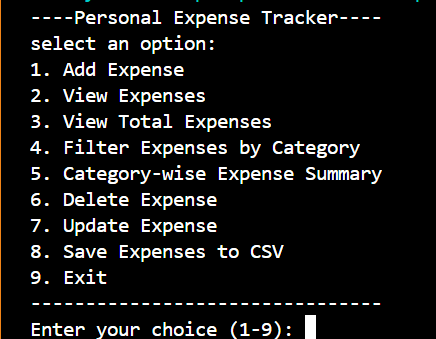
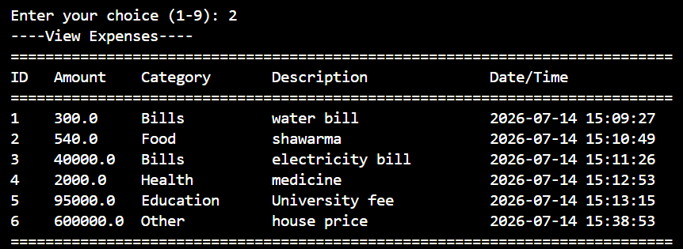

# 📊 CloudExify Python Project 1 - Expense Tracker


A simple, efficient, and user-friendly **console-based Expense Tracker** developed in **Python** as part of the **CloudExify Python Internship 2026**.

---

# 👨‍💻 Developer

**Name:** Muhammad Hassaan

**Registration Number:** CX-INT-2026-PY-0277

**Internship:** CloudExify Python Internship 2026

---

# 📖 Project Overview

The **Expense Tracker** helps users manage their daily expenses through a clean console interface.

The application supports:

- Recording expenses
- Updating existing expenses
- Deleting expenses
- Viewing all expenses
- Filtering by category
- Viewing total expenses
- Saving data permanently
- Exporting data to CSV for Microsoft Excel

---

# ✨ Features

- ➕ Add Expense
- 📋 View All Expenses
- ✏️ Update Expense
- ❌ Delete Expense
- 🔍 Filter by Category
- 💰 View Total Expenses
- 📊 Category-wise Expense Summary
- 📅 Automatic Date & Time
- 💾 Save Data to Text File
- 📂 Load Saved Data
- 📄 Export to CSV
- ⚠️ Input Validation
- 🛡️ Exception Handling
- 📑 Formatted Table Output
- 🎨 Color the output using colorama library

---

# 🛠️ Technologies Used

| Technology | Purpose |
|------------|---------|
| Python 3 | Core Programming Language |
| File Handling | Data Storage |
| CSV Module | Export Reports |
| Datetime Module | Date & Time |
| Exception Handling | Error Handling |

---

# 📂 Project Structure

```text
cloudexify-python-p1-muhammadhassaan
│
├── expense_tracker.py
├── README.md
└── screenshots
    ├── main_menu.png
    └── expenses.png
```

---

# 🚀 Getting Started

## Clone Repository

```bash
git clone https://github.com/MHassaan2/cloudexify-python-p1-muhammadhassaan.git
```

## Navigate to Project

```bash
cd cloudexify-python-p1-muhammadhassaan
```

## Run Application

```bash
python expense_tracker.py
```

---

# 📸 Screenshots

| 🏠 Main Menu | 📊 Expense List |
|---------------|-----------------|
|||

---

# 📈 Sample CSV Output

```csv
ID,Amount,Category,Description,Date/Time
1,500,Food,Burger,2026-07-10 21:35:22
2,350,Transport,Metro Fare,2026-07-11 09:20:45
3,1200,Shopping,T-Shirt,2026-07-12 15:40:18
```

---

# 🎯 Learning Outcomes

During this project I practiced:

- Python Functions
- Lists & Dictionaries
- Modular Programming
- File Handling
- CSV File Export
- Exception Handling
- Input Validation
- Data Management
- Problem Solving

---

# 🚀 Future Improvements

- 🖥️ Tkinter GUI
- 🔍 Search Expenses
- 📅 Date Range Filter
- 📊 Charts & Analytics
- 📄 Export to PDF
- 🗄️ SQLite Database

---

# ⭐ Repository

If you found this project helpful, consider giving it a ⭐ on GitHub.

---

## 🙏 Acknowledgement

Developed as **Project 1** for the **CloudExify Python Internship Program (2026)** to strengthen Python programming fundamentals, file handling, and problem-solving skills.
